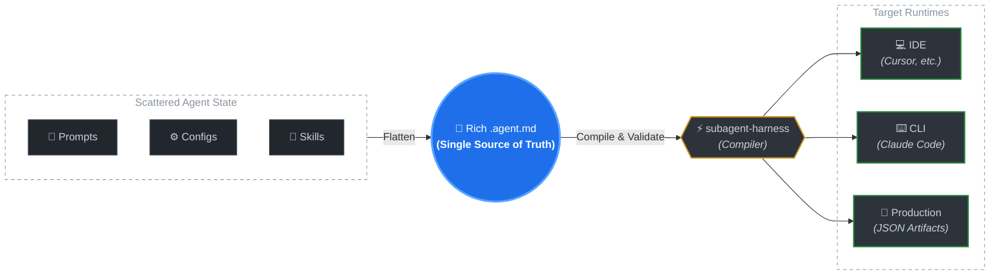

# subagent-harness

> **Evolve your agent in one place. Use it anywhere.**

Stop copy-pasting prompts across `.cursorrules`, Claude Code, and your CI pipelines. `subagent-harness` takes your single markdown file and auto-magically translates it for every AI tool you use.

📖 **[Read the full story: Why AI Agents need a "Compiler" and Governance Flow](https://dev.to/jz_er/beyond-copy-paste-why-ai-agents-need-a-compiler-and-governance-flow-3dg0)**



## Supported Targets

| Target | Generated Format | Purpose |
| ------ | ---------------- | ------- |
| **Cursor** | `.cursor/agents/*.md` | Local IDE autocomplete & agent generation |
| **Claude Code** | `.claude/skills/*.md` | Global CLI skills |
| **Production** | `dist/agents/*.json` | CI/CD pipelines & backend SDK consumption |

*More integrations planned: Windsurf, Copilot, Cline.*

---

## How it works: The Output

You write one file. The harness generates the rest.

```text
# 1. You write this (Single Source of Truth)
my-agents/
└── changelog-extractor.agent.md   

# 2. Run subagent-harness
$ pnpm exec subagent-compose --apply

# 3. It generates these auto-magically:
.cursor/agents/
└── changelog-extractor.md         # Formatted natively for Cursor
.claude/skills/
└── changelog-extractor/SKILL.md   # Formatted natively for Claude Code
dist/
└── changelog-extractor.json       # Strict JSON for your backend/CI
```

---

## The Problem — "Living Agent" Drift

Agents are **living artifacts**. Their prompts, configs, and skills evolve constantly.
When the same agent lives in two places — your IDE and your CI pipeline — iteration guarantees drift.

### A ground-truth story

Bob builds `changelog-extractor`, a tiny sub-agent:

| Component | Initial state |
|-----------|---------------|
| **Prompt** | *"Read recent commits, group by feature/fix, output a markdown list."* |
| **Skills** | `read_git_log` · `read_jira_ticket` |

He copies this definition into **Cursor** (`.cursor/agents/`) for local dev, and into the **CI pipeline** (rich JSON) for automated GitHub Releases.

Then the iteration begins:

| # | What changed | Detail |
|---|-------------|--------|
| 1 | **Format** | Marketing wants customer-facing language → prompt rewritten |
| 2 | **New skill** | Needs PR context → adds `fetch_pr_description` |
| 3 | **Config** | LLM hallucinating → `temperature: 0.1`, hard constraint added |

Bob updates the CI config. He forgets to sync the Cursor copy.

Developers now run a **stale local agent** that hallucinates, misses PR context, and outputs raw technical jargon — while the production version works fine.

> **Root cause:** No Single Source of Truth. No automated composition.
> Iterating on an agent _guarantees_ environment drift.

**How subagent-harness fixes it:**
1. **Single file** — Write `changelog-extractor.agent.md` once. This is the only copy.
2. **Auto-validate** — On commit, the harness checks structure and required fields.
3. **Compose per runtime** — `compose` emits full config for CI, and stripped proprietary `.md` for Cursor.
4. **Zero drift** — Next iteration, edit one file. The change propagates everywhere automatically.

---

## Quickstart

```bash
# 1. Install
pnpm add -D subagent-harness

# 2. Preview what the harness will generate (no file writes)
pnpm exec subagent-compose \
  --src ~/my-custom-agents \
  --dst ~/.cursor/agents \
  --dry-run

# 3. Generate runtime-ready files
pnpm exec subagent-compose \
  --src ~/my-custom-agents \
  --dst ~/.cursor/agents \
  --apply
```

Reload your IDE window → open the Subagents list → your agent is discovered, formatted, and in sync with the SSOT.

> Full walkthrough: **[5-Minute Quickstart](docs/QUICKSTART_5_MIN.md)**

---

## Built-in Quality Gates

It's not just a format converter; it's a governance pipeline. Before any agent is compiled, it passes through 3 layers of tests to ensure absolute reliability:

1. **Schema Validation (L1):** Prevents missing fields, broken YAML frontmatter, or syntax errors.
2. **Runtime Contract (L2):** Ensures the generated output matches exactly what Cursor/Claude actually supports.
3. **Live Smoke Check (L3):** (Optional) Boots up a real process to verify the compiled agent won't crash your IDE or backend.

Run all layers locally:
```bash
pnpm test:e2e
```

---

## Programmatic Embedding (CLI / Production)

`subagent-harness` is not only a CLI. You can import it as a package inside your own terminal app, backend worker, or release pipeline.

```ts
import { readFileSync } from "node:fs";
import {
  parseRichAgentMarkdown,
  validateRichAgent,
  composeSubagent
} from "subagent-harness";

const sourcePath = "agents/changelog-extractor.agent.md";
const content = readFileSync(sourcePath, "utf8");

const doc = parseRichAgentMarkdown(sourcePath, content);
const validation = validateRichAgent(doc);

if (!validation.ok) {
  throw new Error(
    `Invalid agent definition: ${validation.issues.map((i) => i.code).join(", ")}`
  );
}

// Built-in v0 target
const cursorAgent = composeSubagent(doc, "cursor");

// You can also map `doc.frontmatter` + `doc.body` into your own runtime schema.
```

This lets product runtime and IDE runtime consume the same SSOT file while keeping environment-specific adapters isolated.

---

## Demo Video

[Managing AI Agent Drift](docs/media/Managing_AI_Agent_Drift.mp4)

<video controls width="100%">
  <source src="docs/media/Managing_AI_Agent_Drift.mp4" type="video/mp4" />
  Your browser does not support the video tag.
</video>

---

## Staying Updated

> **Status:** Pre-RC. The format and API are stabilizing but not yet frozen. Follow releases to stay informed.

subagent-harness uses **git tags and GitHub Releases** as the primary version signal. Choose whichever subscription method fits your workflow:

| Method | How | Best for |
|--------|-----|----------|
| **Watch → Releases** | Click **Watch** on this repo → **Custom** → check **Releases only** | Lightweight human notification |
| **Dependency automation** | Configure [Dependabot](https://docs.github.com/en/code-security/dependabot), [Renovate](https://docs.renovatebot.com/), or similar tools to monitor this repo's tags | Auto-PR when a new version is available |
| **Downstream registry** | Add your project to [`downstream.json`](downstream.json) via PR | Receive an automated issue on each release |
| **RSS** | Subscribe to `https://github.com/ERerGB/subagent-harness/releases.atom` | Feed reader integration |

---

## Samantha Mini-Test

A small integration of the [Samantha project](https://github.com/leilei926524-tech/samantha) (emotional AI companion from *Her*) into subagent-harness:

```bash
pnpm compose --dry-run   # Preview
pnpm compose --apply     # Compose to .cursor/agents
```

See [Samantha Quickstart](docs/SAMANTHA_QUICKSTART.md) for full walkthrough.

---

## Docs

| Document | Purpose |
|----------|---------|
| [5-Minute Quickstart](docs/QUICKSTART_5_MIN.md) | Hands-on onboarding guide |
| [Samantha Quickstart](docs/SAMANTHA_QUICKSTART.md) | Samantha mini-test integration |
| [YAML Subset](docs/YAML_SUBSET.md) | Supported YAML features and parser boundaries |
| [Beta Feedback Form](docs/BETA_FEEDBACK.md) | Structured feedback for testers |
| [Governance Agreement](docs/AGREEMENT.md) | Maintainer agreement & migration triggers |
| [Governance Navigation](docs/GOVERNANCE.md) | Governance entry point |
| [Trusted Publishing](docs/TRUSTED_PUBLISHING.md) | npm publish via GitHub Actions OIDC |

## License

Apache-2.0