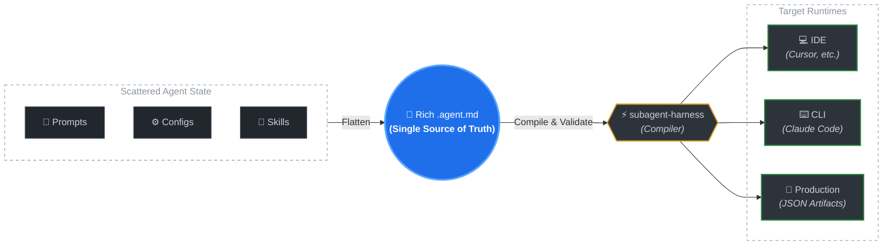

# subagent-harness

> **Stop rewriting agents per runtime.**
> Define once as SSOT, compose everywhere.

A **build-time compiler** that parses, validates, and composes rich sub-agent definitions into runtime-specific agent files. It reads `.agent.md` sources and emits target-native formats — runtime consumers read the compiled output, not the source.

> **Design boundary:** subagent-harness is a build tool, not a runtime SDK. It runs during CI/build to produce artifacts that any language can consume (Markdown for IDEs, JSON for production). Runtime profile resolution and model merging happen at build time. If your project needs runtime dynamic resolution, see [#3 — Runtime SDK exploration](https://github.com/ERerGB/subagent-harness/issues/3).

📖 **[Read the full story: Why AI Agents need a "Compiler" and Governance Flow](https://dev.to/jz_er/beyond-copy-paste-why-ai-agents-need-a-compiler-and-governance-flow-3dg0)**



## Demo Video

[Managing AI Agent Drift](docs/media/Managing_AI_Agent_Drift.mp4)

<video controls width="100%">
  <source src="docs/media/Managing_AI_Agent_Drift.mp4" type="video/mp4" />
  Your browser does not support the video tag.
</video>

---

## The Problem — "Living Agent" Drift

Agents are **living artifacts**. Their prompts, configs, and skills evolve constantly.
When the same agent lives in two places — your IDE and your CI pipeline — iteration guarantees drift.

### A ground-truth story

Bob builds `changelog-extractor`, a tiny sub-agent:

| Component | Initial state |
|-----------|---------------|
| **Prompt** | *"Read recent commits, group by feature/fix, output a markdown list."* |
| **Skills** | `read_git_log` · `read_jira_ticket` |

He copies this definition into **Cursor** (`.cursor/agents/`) for local dev, and into the **CI pipeline** (rich JSON) for automated GitHub Releases.

Then the iteration begins:

| # | What changed | Detail |
|---|-------------|--------|
| 1 | **Format** | Marketing wants customer-facing language → prompt rewritten |
| 2 | **New skill** | Needs PR context → adds `fetch_pr_description` |
| 3 | **Config** | LLM hallucinating → `temperature: 0.1`, hard constraint added |

Bob updates the CI config. He forgets to sync the Cursor copy.

Developers now run a **stale local agent** that hallucinates, misses PR context, and outputs raw technical jargon — while the production version works fine.

> **Root cause:** No Single Source of Truth. No automated composition.
> Iterating on an agent _guarantees_ environment drift.

---

## The Solution — A Governance Pipeline

`subagent-harness` replaces manual copy-paste with a deterministic pipeline:

```
Source  ──▶  Audit  ──▶  Compose  ──▶  Smoke
  │            │            │             │
  │  rich      │  schema    │  strip &    │  IDE + production
  │  .agent.md │  validate  │  generate   │  runtimes consume ✓
```

**How Bob fixes it:**

1. **Single file** — He writes `changelog-extractor.agent.md` with the prompt, `temperature: 0.1`, and all three skills. This is the only copy.

2. **Auto-validate** — On commit, the harness checks structure and required fields.

3. **Compose per runtime** — One command reads the SSOT. For CI, it emits full config. For Cursor, it strips proprietary fields and outputs a clean `.md`.

4. **Zero drift** — Next iteration, Bob edits one file. `compose` propagates everywhere.

**Result:**

| Before | After |
|--------|-------|
| 2 copies, manual sync, silent drift | 1 source, automated compose, deterministic |
| IDE agent lies vs production agent | IDE and production always match |
| Adding a new runtime = copy-paste again | Adding a runtime = new adapter, source untouched |

---

## Quickstart

```bash
# 1. Install
pnpm add -D subagent-harness

# 2. Preview what the harness will generate (no file writes)
pnpm exec subagent-compose \
  --src ~/my-custom-agents \
  --dst ~/.cursor/agents \
  --dry-run

# 3. Generate runtime-ready files
pnpm exec subagent-compose \
  --src ~/my-custom-agents \
  --dst ~/.cursor/agents \
  --apply

# 4. Verify idempotence — run again, nothing should change
pnpm exec subagent-compose \
  --src ~/my-custom-agents \
  --dst ~/.cursor/agents \
  --apply
```

Reload your IDE window → open the Subagents list → your agent is discovered, formatted, and in sync with the SSOT.

> Full walkthrough: **[5-Minute Quickstart](docs/QUICKSTART_5_MIN.md)**

---

## E2E Testing Layers

To avoid false confidence, runtime verification is split into 3 layers:

### L1 — Compose Pipeline Integration

- Parse `.agent.md` + `.agent.ext.yaml`
- Validate
- Compose artifacts for Cursor / Claude Code / Production
- Write + reload artifacts

Command:

```bash
pnpm test:l1
```

### L2 — Runtime Format Compliance

- Enforce output contracts (required/forbidden fields)
- Catch adapter regressions before real runtime checks

Command:

```bash
pnpm test:l2
```

### L3 — Live Runtime Smoke

- **Production**: required in CI, real Node process loads and executes compiled artifact
- **Cursor / Claude Code**: real-environment probe commands (optional by default)

Command:

```bash
pnpm test:l3
```

Optional probe env vars for real local runtime checks:

```bash
export CURSOR_RUNTIME_CHECK_CMD='your-cursor-smoke-command-using-$AGENT_FILE'
export CLAUDE_RUNTIME_CHECK_CMD='your-claude-smoke-command-using-$AGENT_FILE'

# Optional strict mode (comma-separated): production,cursor,claude
export L3_REQUIRE_TARGETS='production,cursor,claude'
```

Run all layers:

```bash
pnpm test:e2e
```

---

## Programmatic Embedding (CLI / Production)

`subagent-harness` is not only a compose CLI. You can import it as a package inside your own terminal app, backend worker, or release pipeline.

```ts
import { readFileSync } from "node:fs";
import {
  parseRichAgentMarkdown,
  validateRichAgent,
  composeSubagent
} from "subagent-harness";

const sourcePath = "agents/changelog-extractor.agent.md";
const content = readFileSync(sourcePath, "utf8");

const doc = parseRichAgentMarkdown(sourcePath, content);
const validation = validateRichAgent(doc);

if (!validation.ok) {
  throw new Error(
    `Invalid agent definition: ${validation.issues.map((i) => i.code).join(", ")}`
  );
}

// Built-in v0 target
const cursorAgent = composeSubagent(doc, "cursor");

// You can also map `doc.frontmatter` + `doc.body` into your own runtime schema.
```

This lets product runtime and IDE runtime consume the same SSOT file while keeping environment-specific adapters isolated.

---

## References & Prior Art

| Concept | Reference | How it relates |
|---------|-----------|----------------|
| **Prompt Drift** | [*Designing AI Features Without Prompt Drift*](https://dev.to/zywrap/designing-ai-features-without-prompt-drift-105b) | Describes the exact degradation pattern our SSOT model prevents |
| **Git-as-Source-of-Truth** | [*Agentsmith Architecture*](https://agentsmith.dev/docs/core-concepts/architecture) | Advocates version-controlled prompts over UI-based delivery — we share this principle |
| **IDE Format Portability** | [*Migrating Cursor Rules to AGENTS.md*](https://www.adithyan.io/blog/migrating-cursor-rules-to-agents) | Community exploration of breaking out of proprietary IDE formats — the gap we bridge |

---

## Staying Updated

> **Status:** Pre-RC. The format and API are stabilizing but not yet frozen. Follow releases to stay informed.

subagent-harness uses **git tags and GitHub Releases** as the primary version signal. Choose whichever subscription method fits your workflow:

| Method | How | Best for |
|--------|-----|----------|
| **Watch → Releases** | Click **Watch** on this repo → **Custom** → check **Releases only** | Lightweight human notification |
| **Dependency automation** | Configure [Dependabot](https://docs.github.com/en/code-security/dependabot), [Renovate](https://docs.renovatebot.com/), or similar tools to monitor this repo's tags | Auto-PR when a new version is available |
| **Downstream registry** | Add your project to [`downstream.json`](downstream.json) via PR | Receive an automated issue on each release |
| **RSS** | Subscribe to `https://github.com/ERerGB/subagent-harness/releases.atom` | Feed reader integration |

---

## Docs

| Document | Purpose |
|----------|---------|
| [5-Minute Quickstart](docs/QUICKSTART_5_MIN.md) | Hands-on onboarding guide |
| [YAML Subset](docs/YAML_SUBSET.md) | Supported YAML features and parser boundaries |
| [Beta Feedback Form](docs/BETA_FEEDBACK.md) | Structured feedback for testers |
| [Governance Agreement](docs/AGREEMENT.md) | Maintainer agreement & migration triggers |
| [Governance Navigation](docs/GOVERNANCE.md) | Governance entry point |
| [Trusted Publishing](docs/TRUSTED_PUBLISHING.md) | npm publish via GitHub Actions OIDC |

## License

Apache-2.0
